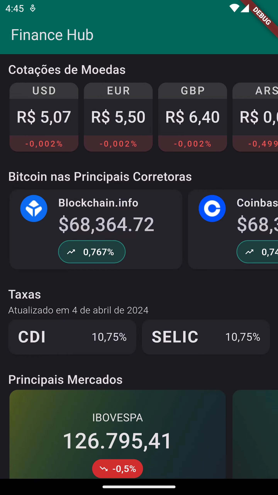
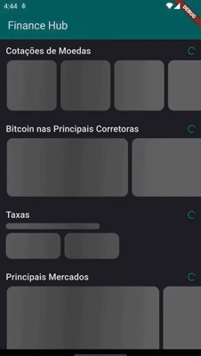

<h1 align="center">💸 Finance Hub 📈</h1>

<p align="center">
<a href="https://www.metropoledigital.ufrn.br/portal/"></a>
<br>
<a href="https://flutter.dev/"></a>
</p>

<p align="center">


</p>

Aplicativo com hub de dados financeiros.

## 🏁 Iniciando

Essas instruções lhe darão uma cópia do projeto e um caminho para executá-lo localmente para fins de desenvolvimento e teste.

### ⚙️ Pré-Requisitos

O projeto faz uso de dependências externas e de variáveis de ambiente, de modo que é necessário passar por alguns passos antes de executar o código.

#### 🔑 Variáveis de Ambiente

Esse projeto precisa de uma chave para a API da [HG Brasil](https://hgbrasil.com/). Com essa chave em mãos, copie o arquivo `.env.example` para `.env`:

```bash
cp .env.example .env
```

Em seguida, preencha a variável `HG_API_KEY` com a chave. O campo `HG_BASE_URL` pode ser mantido com o valor padrão.

#### 📦 Dependências

O Finance Hub usa o pacote [`provider`](https://pub.dev/packages/provider) para gerir o estado da aplicação. Com isso, antes de executar o projeto, instale as dependências através do seguinte comando:

```bash
flutter pub get
```

### 🚀 Execução

Para executar o projeto, siga o fluxo regular de debug de uma aplicação Flutter, lembrando de configurar a IDE para carregar os dados do arquivo `.env`. No VS Code, por exemplo, não é necessário fazer nada, pois o arquivo `.vscode/launch.json` já define esse passo para a execução.

Em outras ferramentas, você deve garantir que a flag `--dart-define-from-file=.env` seja passada no comando que executa o projeto.

## ⚖️ Licença

Esse projeto é distribuído sob a Licença MIT. Leia o arquivo [LICENSE](LICENSE) para ter mais detalhes.
